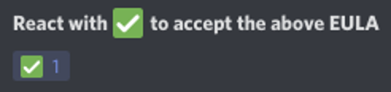
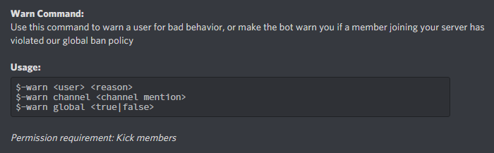

# Frequently Asked

##  Verification System 

### What is it? 

The verification system requires that you meet certain requirements before being allowed to send links or attachments to the global chat.

### Why is it? 

The verification system exists in order to prevent new users from joining and posting NSFW links and/or images in the global chat.

### How do I verify? 

You will become verified upon reaching the 100 message milestone in global chat.


Reaching 100 messages by spamming will result in your account being blocked from using the global chat


## End User License Agreement \(EULA\) 

### What is it? 

The [EULA](../legal/eula.md) is a legal agreement between you and the bot developer stating that you won't violate Discord's [Terms of Service](https://discordapp.com/terms) \(ToS\) through global chat. If you do, it will be a breach of a legal document, and you can be punished by the full extent of the law.

### Why is it? 

The [EULA](../legal/eula.md) exists to ensure the safety of the bot. The global chat feature sends your messages to every other connected channel, so if you send a [not-safe-for-work](https://en.wikipedia.org/wiki/nsfw) \(NSFW\) link/image, the bot will send it to channels that most likely aren't marked as NSFW. This is a violation of Discord's [ToS](https://discordapp.com/terms), and if a user reports the bot's message, Discord staff might shut down the bot account.

### How do I accept? 

The easiest way to accept the [EULA ](../legal/eula.md)is through the `$-eula` command. This command outputs an invite link; following the link will take you directly to the [EULA ](../legal/eula.md)channel on the bot's support server. Even if you're already in the server, clicking on the link will take you to the correct channel. From there, its as simple as reading the agreement, then adding a check mark reaction.

## Server TPS 

### What is it? 

TPS stands for "ticks per second". This value represents how many operations per second the host computer is able to handle without any server-side latency. Most latency experienced while using HaileyBot is either network latency, or a result of [Discord's rate limits](https://discordapp.com/developers/docs/topics/rate-limits).

## Global Ban List 

### What is it? 

The Global Ban List is a list of user IDs who have been banned in accordance with HaileyBot's [Global Ban Policy](gbp.md).

### Why is it? 

The Global Ban List exists to aid server owners in discovering "problem players" - users who have a tendency to intentionally break rules or wreak havoc.

### How do I implement it? 

You can set up HaileyBot to automatically warn you when a member joining your server has violated the Global Ban Policy, as well as warning you when an existing member in your server has been added to the Global Ban List. These settings are available under the `$-warn` command.

Additionally, you can use the command `$-ban global` to sync HaileyBot's Global Ban List with your server, banning everyone who has violated the Global Ban Policy.

## Global Emotes 

### Why don't they work in Global Chat? 

**TL;DR:** They actually do.

On Discord, bot accounts have the same emoji abilities as a Discord Nitro user. A bot can use custom emotes across different servers, outside of the server the emote originates from. However, just like a Discord Nitro user, a bot can't use a custom emote from a server the bot isn't in. Global Emotes work perfectly fine in Global Chat, as long as HaileyBot is in the emote's server. Unfortunately, there is no way around this limitation.

