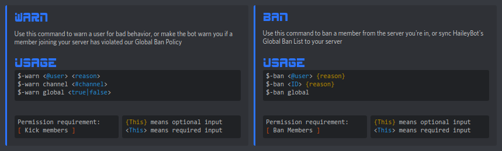

# Frequently Asked

##  Verification System 

### What is it? 

The verification system requires that you meet certain requirements before being allowed to send links or attachments to the global chat.

### Why is it? 

The verification system exists in order to prevent new users from joining and posting NSFW links and/or images in the global chat.

### How do I verify? 

You will become verified upon reaching the 100 message milestone in global chat.


Reaching 100 messages by spamming will result in your account being blocked from using the global chat


## Global Ban List 

### What is it? 

The Global Ban List is a list of user IDs who have been banned in accordance with HaileyBot's [Global Ban Policy](gbp.md).

### How do I implement it? 

You can set up HaileyBot to automatically warn you when a member joining your server has violated the Global Ban Policy, as well as warning you when an existing member in your server has been added to the Global Ban List.

For a more direct approach, you can use the `$-ban` command to sync the Global Ban List with your server, which will prevent all globally banned users from being able to join your server.

## Other Common Questions 

### What is Server TPS? 

TPS stands for "ticks per second". This value represents how many operations per second the host computer is able to handle without any server-side latency. Most latency experienced while using HaileyBot is either network latency, or a result of [Discord's rate limits](https://discordapp.com/developers/docs/topics/rate-limits).

### Why don't custom emotes work in Global Chat? 

**TL;DR:** They actually do.

On Discord, bot accounts have the same emoji abilities as a Discord Nitro user. A bot can use custom emotes across different servers, outside of the server the emote originates from. However, just like a Discord Nitro user, a bot can't use a custom emote from a server the bot isn't in. Global Emotes work perfectly fine in Global Chat, as long as HaileyBot is in the emote's server. Unfortunately, there is no way around this limitation.

### Why is the Global Chat English only? 

There are people from all over the world connected to the Global Chat, so guidelines needed to be put in place in order to keep it true to is original purpose of providing a place to meet and connect with new people. English is the most common language in the world \([source](https://rebrand.ly/languages-by-country)\), and therefore is understood by more people than any other language. The Global Chat is for having conversations, which aren't possible if we don't understand each other.

